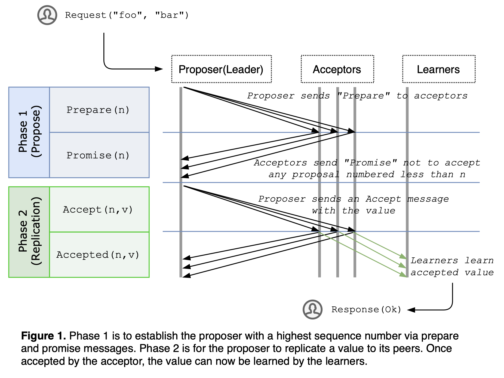
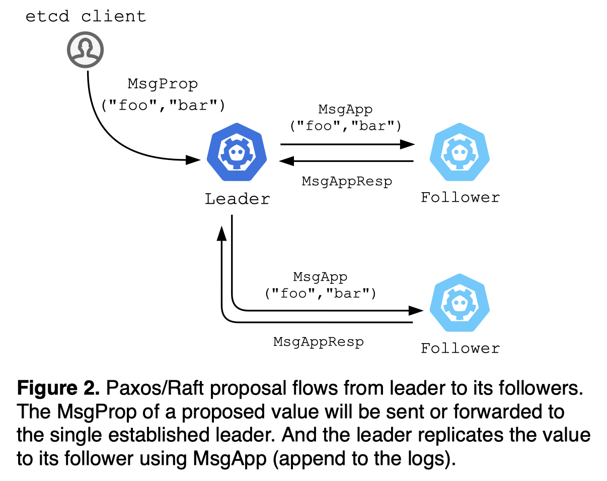
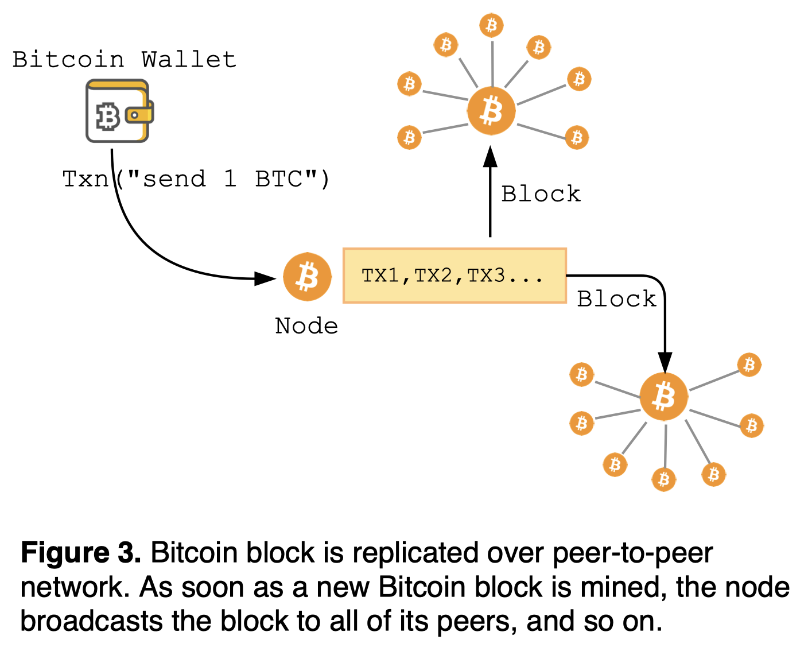
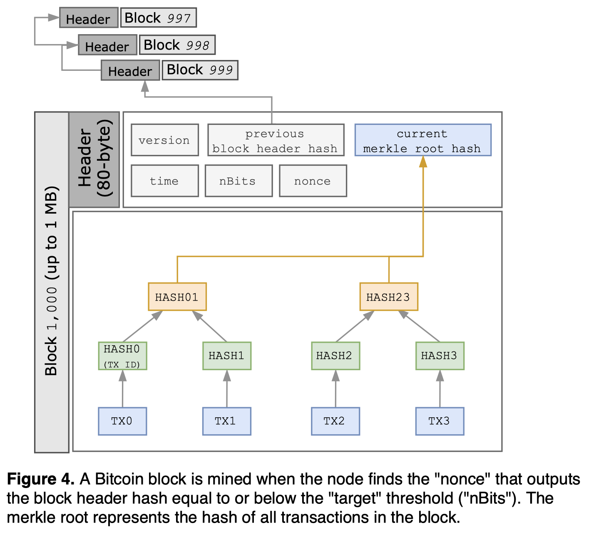
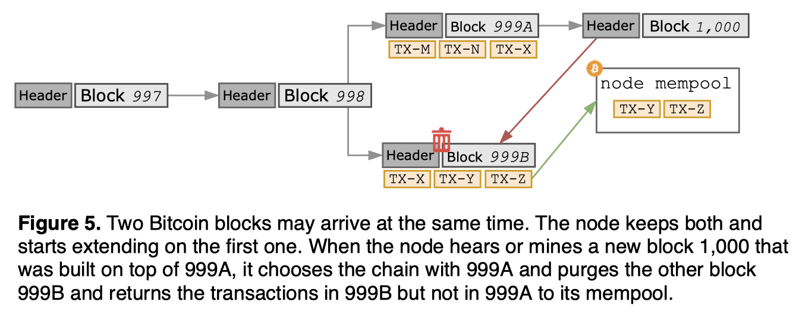

# Paxos(etcd) vs. Nakamoto(Bitcoin): consensus

*Last update: October 27, 2021*

*Next: [Nakamoto(Bitcoin) vs. Snow(Avalanche): consensus](./nakamoto-bitcoin-vs-snow-avalanche-consensus.md)*

- [What is consensus?](#what-is-consensus)
- [What is Paxos consensus?](#what-is-paxos-consensus)
- [What is Nakamoto consensus?](#what-is-nakamoto-consensus)
- [Unspent transaction output (UTXO)](#unspent-transaction-output-utxo)
- [Agreement in Paxos](#agreement-in-paxos)
- [Agreement in Nakamoto](#agreement-in-nakamoto)
  - [Adversary node](#adversary-node)
  - [Sybill attack](#sybill-attack)
  - [DoS (Denial of Service) attack](#dos-denial-of-service-attack)
- [Agreement in Nakamoto (continued)](#agreement-in-nakamoto-continued)
  - [Who initiates the block (data)?](#who-initiates-the-block-data)
    - [Peer/node discovery](#peernode-discovery)
    - [Message relay](#message-relay)
  - [What's in the block (data)?](#whats-in-the-block-data)
    - [Unit of consensus](#unit-of-consensus)
    - [Data structure](#data-structure)
    - [Payload and data limit](#payload-and-data-limit)
  - [How to resolve the block (data) conflicts?](#how-to-resolve-the-block-data-conflicts)
    - [Definition of conflict](#definition-of-conflict)
    - [Definition of longest chain](#definition-of-longest-chain)
    - [Choice between conflicting chains](#choice-between-conflicting-chains)
  - [How to distribute the block (data)?](#how-to-distribute-the-block-data)
    - [Build consensus](#build-consensus)
    - [Information propagation speed and finality](#information-propagation-speed-and-finality)
- [Summary](#summary)
- [Reference](#reference)

### What is consensus?

Applications may crash, [server hardwares fail](https://conferences.sigcomm.org/sigcomm/2011/papers/sigcomm/p350.pdf), natural disasters can take out data centers in a region. To limit the impact of such occasional but inevitable failures, the system must develop the redundancy for the service. This strategy often entails geographically distributing a system, which requires a consistent view of the system state. The distributed consensus enables this group of processes to reach an agreement on a value in the face of asynchronous, unreliable networks: critical configuration data, leader election, service/member discovery, distributed locking, etc..

> Assume a collection of processes that can propose values. A consensus algorithm ensures that a single one among the proposed values is chosen.
>
> *Leslie Lamport, [Paxos Made Simple (2001)](https://lamport.azurewebsites.net/pubs/paxos-simple.pdf)*

### What is Paxos consensus?

Introduced by *Leslie Lamport, [The Part-Time Parliament (1988)](https://lamport.azurewebsites.net/pubs/lamport-paxos.pdf)*, the Paxos algorithm enables a group of processes to agree on a value and proposal number. And if the value is chosen, then processes should be able to learn the chosen value.

Multi-Paxos is the de-facto solution for building a replicated state machine (RSM) that executes the same set of commands in the same order, on multiple participants. Single-decree Paxos is the \\(i^{th}\\) instance that decides the \\(i^{th}\\) command in the log. That is, Multi-Paxos operates as a sequence of proposals, each of which may or may not be accepted by a majority of the participants. The proposal sequence number is used to impose a strict order on the commands.

[Raft](https://raft.github.io) is a consensus algorithm built on top of Multi-Paxos, and [etcd](https://github.com/etcd-io/etcd) uses Raft to build a distributed key-value store (e.g., [Kubernetes](https://kubernetes.io/) uses etcd for cluster metadata).

### What is Nakamoto consensus?

Introduced by *Satoshi Nakamoto, [Bitcoin: A Peer-to-Peer Electronic Cash System (2008)](https://bitcoin.org/bitcoin.pdf)*, the Nakamoto algorithm solves the agreement problem in the face of Byzantine faults, where malicious nodes may pass incorrect messages.

Nakamoto consensus powers Bitcoin to achieve a distributed consensus on the chain without relying on any trusted third party. Bitcoin is a permissionless Blockchain, allowing anyone to create blocks through transactions among participating nodes. The chain state and transaction logs are transparent and accessible to any anonymous participant. Thus, the focus is on the byzantine fault tolerance, [sybil attack](https://www.microsoft.com/en-us/research/wp-content/uploads/2002/01/IPTPS2002.pdf) protection, and DoS (Denial of Service) resistance.

### Unspent transaction output (UTXO)

Bitcoin uses the [unspent transaction output (UTXO) model](https://en.wikipedia.org/wiki/Unspent_transaction_output) to record the state of individual coin transfers between wallets (much like physical coins), instead of tracking the balance of each account (e.g., Ethereum). A UTXO represents an output of a transaction that has not been spent and thus can be used as an input to a new transaction -- only the unspent output can be used for the next transaction to prevent double-spending. Each UTXO is a chain of ownership where the current owner (sender) signs the transaction that transfers the UTXO ownership to the public key of the new owner (receiver).

The total UTXO sets in a blockchain represent the set that every transaction consumes elements from and creates new ones to, which represents the total supply of the currency. When a transaction occurs, the transaction input (e.g., send 2.5 BTC from A to B) is to be destroyed from the UTXO set, and the respective output (e.g., receive 2.5 BTC from A to B) creates a new UTXO to the UTXO set. Such UTXO model enables client-side aggregation, reducing the computation requirements in the network, making it easier to parallelize transactions.

### Agreement in Paxos

Paxos assumes each process operates at arbitrary speeds and may fail or restart at any time. Messages may take arbitrarily long to deliver, be duplicated, or be lost, but they are not corrupted.

Single-decree Paxos is a two-phase protocol. In the first phase of the protocol (prepare/promise phase), the proposer sends a message with a sequence number \\(n\\) to the acceptors (peers) -- *"Prepare"*. And the acceptor responds to the proposal if and only if the sequence number \\(n\\) is higher than every previously accepted proposal number -- *"Promise"* to never again accept the proposal numbered less than \\(n\\). If the sequence number \\(n\\) is less than or equal to any previously accepted proposal, the acceptor can ignore the proposal. Or the acceptor rejects the proposal to respond with the highest sequence number it has ever seen. In the second phase of the protocol (accept/learn), once the proposer secures the agreement to its "prepare" request from the majority of the acceptors, the proposer can now request a value \\(v\\) with the sequence number \\(n\\) to be accepted -- *"Accept"*. And once accepting the chosen value \\(v\\), the acceptor can inform its learner with the accepted value \\(v\\) -- *"Learn"*.



Then, what if two proposers keep sending a sequence of proposals with increasing sequence numbers, while acceptors keep promising to accept the highest but none of which is ever chosen? One proposer may complete the phase 1 for a sequence number but its accept message can get ignored, because the other proposer could have completed another phase 1 with a higher number in-between. To prevent such conflict, only one proposer is elected to be the leader that exclusively issues the proposals: Each single-decree Paxos instance must establish a leader, and then proceed with phase 2 to chose the value.

In normal operation, Multi-Paxos establishes a stable leader to act as the distinguished proposer for multiple Paxos instances (by implementing leader lease). Clients send commands to the leader (forwarded to the leader). If no participant is acting as leader, then the cluster cannot make any progress. [Raft](https://raft.github.io) is a consensus algorithm adopting the Multi-Paxos policy. As an analogy, here's how [etcd](https://github.com/etcd-io/etcd) uses Raft to process its writes:

1. Each etcd node starts as a follower.
2. The follower becomes candidate if there is no leader heartbeat for the duration of election timeout (1-second).
3. The candidate sends `MsgVote` to its peers.
4. The follower votes for the candidate if and only if the candidate's logs are up-to-date (log term and index).
5. The candidate becomes leader for the respective term, once it receives the votes from quorum.
6. The client requests are forwarded to leader. The leader decides what to commit or not, and always contains the latest data while follower nodes may have stale data.
7. The client request generates `MsgProp` (proposal) to the leader. The `MsgProp` sent to follower shall be forwarded to the leader.
8. Upon receiving `MsgProp`, the leader sends `MsgApp` (append) to its peers. The append request always flows from leader to follower.
9. If the `MsgApp` log term and index are valid (up-to-date), the follower accepts `MsgApp` and marks the message as committed.
10. The committed entries are safe to apply (persisted in quorum): The etcd server polls committed entries from Raft and applies to its backend storage (replicated state machine).

### Agreement in Nakamoto

The key difference is: Paxos assumes the fixed set of servers, whereas Nakamoto is permissionless and open to any participant. Paxos/Raft membership reconfiguration itself (member add/remove) requires consensus from quorum, whereas Nakamoto uses [DNS for peer discovery](https://developer.bitcoin.org/devguide/p2p_network.html#peer-discovery). Bitcoin being a public, permissionless blockchain introduces different kinds of attacking vectors, which is a key to understanding its consensus mechanism.

#### Adversary node

A malicious actor or software error may exhibit Byzantine (i.e., arbitrary) behavior. For instance, a transaction "A pays B $100" becomes "A pays C $10,000". To prevent such identity spoofing and detect corrupted messages, Nakamoto consensus uses cryptographic techniques.

Bitcoin is a chain of digital signatures. Each Bitcoin wallet contains one or more [Elliptic Curve Digital Signature Algorithm (ECDSA)](https://en.wikipedia.org/wiki/Elliptic_Curve_Digital_Signature_Algorithm) private keys, which are mathematically related to its addresses. The respective public key is used to determine if the signature is genuine. Bitcoin transfer generates a hash of the previous transaction and the public key of the payee (new owner), which is signed by the private key of the transferrer (previous owner). Then the new owner verifies the incoming transaction with the previous owner's public key. Which makes it virtually impossible for an adversary to impersonate without access to the private key.

Such public-key cryptographic mechanism ensures only the verified owner can spend the balance, but does not prevent the double-spend: The system can still accept transactions that are cryptographically correct but conflicting spends on the same fund. For instance, the previous owner may maliciously sign earlier transactions to double-spend from the same fund -- *A currently has $100 but signs transactions that pay B and C each $100*. The traditional banking system prevents such double-spend by recording all historical transactions (thus aware of which arrived first). In order to accomplish this without the trusted third-party, each Bitcoin transaction must be publicly announced, and the linear view of the transaction history must be validated by the majority of the nodes.

#### Sybill attack

Sybill attack is a scenario when a dishonest group controls as many nodes as required for consensus to taint the outcome in its flavor. For instance, the malicious group who controls more than half of the network may out-vote the honest nodes to exert double-spend or refuse to accept or transmit blocks. Bitcoin uses Proof-of-Work (PoW) to prevent such sybil attack (and for its agreement process).

Bitcoin defines a network-wide "target" number to control the mining difficulty that decides the average number of blocks that can be created per hour -- if blocks are generated too fast, the difficulty increases. The checksum of the block header must be less than or equal to the "target" number in order to be added to the blockchain. Bitcoin uses [SHA-256](https://en.wikipedia.org/wiki/SHA-2) to double-hash the block header -- `SHA256(SHA256(BLOCK_HEADER))`. If the 256-bit number from the hash function is greater than the "target" number, the miner retries the different input. This is where the "nonce" comes in. "nonce" is a 32-bit number embedded in the block header (4-byte field): "nonce" starts from 0, and the miner increments "nonce" by 1 for each hash function call.

The cryptographically strong sha256 hash algorithm outputs a completely different value for different inputs -- *see the code below*. Which means, the process requires enumerating the "nonce" until a hash less than or equal to the "target" value is found. Such process is referred to as mining or Proof-of-Work (PoW), as it requires substantial amount of computing work. When the proper "nonce" is found, the miner is rewarded with a new Bitcoin for its expended CPU time and electricity (i.e., [coinbase transaction](https://en.bitcoin.it/wiki/Coinbase)). Such incentive encourages more decentralization and nodes to stay honest: The more decentralized the networks are, the harder to assemble the CPU power more than all the honest nodes.

```rust,edition2018
use data_encoding::HEXUPPER;
use ring::digest::{Context, Digest, SHA256};
use std::io::{BufReader, Read};

use error_chain::error_chain;
error_chain! {
    foreign_links {
        Io(std::io::Error);
        Decode(data_encoding::DecodeError);
    }
}

fn compute_hash<R: Read>(mut reader: R) -> Result<Digest> {
    let mut context = Context::new(&SHA256);
    let mut buffer = [0; 1024];

    loop {
        let count = reader.read(&mut buffer)?;
        if count == 0 {
            break;
        }
        context.update(&buffer[..count]);
    }

    Ok(context.finish())
}

fn main() -> Result<()> {
    let digest1 = compute_hash(BufReader::new("hello".as_bytes()))?;
    let digest2 = compute_hash(BufReader::new("hello.".as_bytes()))?;

    println!("{}", HEXUPPER.encode(digest1.as_ref()));
    // 2CF24DBA5FB0A30E26E83B2AC5B9E29E1B161E5C1FA7425E73043362938B9824
    println!("{}", HEXUPPER.encode(digest2.as_ref()));
    // 1589999B0CA6EF8814283026A9F166D51C70A910671C3D44049755F07F2EB910

    // just one more character but totally different hash value

    Ok(())
}
```

PoW mechanism serves two purposes in Bitcoin: (1) deter the sybil attack, as each mining node requires a significant monetary investment to grind through the nonces for block creation, and (2) achieve distributed consensus when a miner expresses the acceptance of a new block by working on the next block creation. 

#### DoS (Denial of Service) attack

An attacker may rapidly initiate a large number of transactions to flood the network and consume its storage. PoW rewards behaving miners, however, does not penalize the misbehaving miner. Instead the Bitcoin client implements its own protection mechanisms as [here](https://en.bitcoin.it/wiki/Weaknesses#Denial_of_Service_.28DoS.29_attacks).

### Agreement in Nakamoto (continued)

The "target" in the block header regulates the speed of new block creation. This mining difficulty allows for: (1) the time for the newly mined blocks to propagate across the network before another block gets mined, (2) the time for a chain to establish itself as the longest available chain thus less likely competing to find the next answer only to waste energy, and (3) a consistent rate of new Bitcoin issuance. Now we understand mining is a process of changing "nonce" to modify the block header until it produces a hash less than or equal to the "target" threshold (PoW). But:

- Who initiates the block (data)? (vs. Paxos initiates the consensus when the proposer receives a Proposal message.)
- What's in the block (data)? (vs. Paxos can store any data.)
- How to resolve the block (data) conflicts? (vs. Paxos ensures the leader hold most up-to-date log entries at all times, thus no conflict.)
- How to distribute the block (data)? (vs. Paxos proposer sends a message Accept with the chosen value, and the acceptor informs the learner. That is, the leader is responsible for log replication.)

#### Who initiates the block (data)?

In Paxos, a client can propose any value (data) to any node in the cluster. The write request is forwarded to leader. For instance, an etcd client writes a key-value pair as follows:

```go
// create an etcd client object
cli, _ := clientv3.New(clientv3.Config{
    // hard-coded server endpoints
	Endpoints: []string{
        "10.0.1.5:2379",
        "10.0.1.6:2379",
        "10.0.1.7:2379",
    },
})

cli.Put(ctx, "foo", "bar")
cli.Get(ctx, "foo")
cli.Delete(ctx, "foo")
```

```go
func (n *node) Propose(ctx context.Context, data []byte) error {
	return n.stepWait(ctx, pb.Message{
        Type: pb.MsgProp,
        Entries: []pb.Entry{{Data: data}},
    })
}

// etcd proposal to follower is automatically forwarded to leader
func stepFollower(r *raft, m pb.Message) error {
	switch m.Type {
	case pb.MsgProp:
		m.To = r.lead
		r.send(m)
        ...
```

> In comparison, *how does Bitcoin initiate a block (data) to its consensus protocol?*

##### Peer/node discovery

Unlike Paxos that provides a hard-coded list of server endpoints for client interaction (e.g., `[IP1,IP2,IP3]:2379`), Bitcoin client uses DNS to discover the list of node IPs (see [wiki](https://en.bitcoin.it/wiki/Satoshi_Client_Node_Discovery)).

##### Message relay

Unlike Paxos that has a centralized entity (leader) to relay proposals to, new Bitcoin transactions are broadcast over peer-to-peer network: An initiated transaction from a wallet client is sent to a node as an `inv`entory message, and the node requests the full transaction with `getdata`. After validating the transaction, the node sends the transaction to all of its peers with an `inv`. If the connected peer has not received such announced transaction yet, it sends the `getdata` request to get the transaction details, and so on. Such mesh layout of network can quickly disseminate the announced transaction from one node to the rest of the cluster.





#### What's in the block (data)?

In Paxos, the value (data) itself can be arbitrary, as long as the "value" can be agreed upon by the consensus protocol. The protocol persists other auxiliary fields such as log term and index to track the progress of logs. For instance, in etcd, once the proposal is committed, the entry is encoded to Protocol Buffer and then persisted on disk:

```go
type Storage interface {
    Save(st raftpb.HardState, ents []raftpb.Entry) error
    ...
}

type Entry struct {
	Term  uint64
	Index uint64
	Type  EntryType
	Data  []byte
}

func (w *WAL) saveEntry(e *raftpb.Entry) error {
	b := pbutil.MustMarshal(e)
	rec := &walpb.Record{Type: entryType, Data: b}
	err := w.encoder.encode(rec)
	...
```

> In comparison, *what goes into the Bitcoin block (data)?* *What kind of data can be stored on-chain?*

##### Unit of consensus

Unlike Paxos whose unit of consensus is a single proposed value, the unit of Bitcoin consensus is a block of multiple transactions. Each transaction (e.g., send 1 BTC to a friend) is signed by the current wallet's private key with the signature to provide the mathematical proof and thus protect against malicious actors. Once the signatures are validated, the miner combines those multiple transactions into one single unit of consensus, rather than initiating a new consensus for each transaction.

##### Data structure

Unlike Paxos that assumes the honesty of participants, Bitcoin network is open to arbitrary participants, thus need for auxiliary information to protect against Byzantine faults. Paxos entry (value/consensus unit) only contains the value and log state information (e.g., term and index), whereas Bitcoin block (value/consensus unit) contains chain-hashed metadata in addition to the value itself. Paxos does not specify any dependency or order between the entries -- log term and index are mainly used to track the progress of the Raft node state and ensure the recency of the leader's logs. The sequence of the Bitcoin blocks is strictly ordered, as each block is cryptographically chained to the prior. The sequence of Bitcoin transactions within a single block can be in any order, so long as a transaction which spends an output from the same block is placed after its parent.

The transactions for each block are stored in a [Merkle tree](https://en.wikipedia.org/wiki/Merkle_tree) data structure, where every leaf node is labelled with a data block and every non-leaf node hashes the labels (transaction IDs) of its child nodes. So the merkle tree root represents the hash of all transactions in the block, which proves its data integrity. The merkle tree computes the root in the order the block receives each transaction. Thus, the transaction order is immutable, as changing the order will change the merkle root (thus block hash).

Each block contains more than [1,500 transactions on average](https://www.blockchain.com/charts/n-transactions-per-block) with its total size limited to 1 MB. Each block is identified with a cryptographic hash value. Bitcoin computes the block hash using [SHA-256](https://en.wikipedia.org/wiki/SHA-2) twice on the block header -- `SHA256(SHA256(BLOCK_HEADER))`.

The [block header](https://developer.bitcoin.org/reference/block_chain.html#block-headers) contains the following 80-byte metadata:

- *Version* (4-byte, `int32`): A block version number to indicate the set of block validation rules.
- *Previous block header hash* (32-byte, `char[32]`): `SHA256(SHA256(BLOCK_HEADER))` from the previous block to ensure the immutability of the previous block and its ordering.
- *Merkle root hash* (32-byte, `char[32]`): `SHA256(SHA256())` to hash all transaction IDs for the current block to ensure its immutability.
- *Time* (4-byte, `uint32`): Unix epoch time when the miner started hashing the current block header. The value must be greater than the median time of the previous 11 blocks, and within two hours in the future time if clock has been drifted.
- *nBits* (4-byte, `uint32`): The "target" threshold that this block's header hash must be less than or equal to, in order for the block to be added to the chain.
- *nonce* (4-byte, `uint32`): An arbitrary number that the miner changes to modify the block header hash until it produces a hash less than or equal to the "target" threshold.

The [block](https://developer.bitcoin.org/reference/block_chain.html#serialized-blocks) contains the following:

- *Block header* (80-byte): Contains various metadata for the previous and current blocks.
- *Transaction count*: The total number of transactions in this block, including the coinbase transaction that rewards the miner itself.
- *Transactions*: Includes all transactions for the block in raw transaction format.



##### Payload and data limit

Each etcd request (write, unit of consensus) is limited to 1.5 MB (see [code](https://github.com/etcd-io/etcd/blob/v3.5.1/server/embed/config.go#L57)). Each Bitcoin block (set of transactions, unit of consensus) is limited to 1 MB (see [wiki](https://en.bitcoin.it/wiki/Block_size_limit_controversy)). etcd data set is limited to 2 GB (by default) and can be configured up to 8 GB (see [code](https://github.com/etcd-io/etcd/blob/v3.5.1/server/etcdserver/quota.go#L27-L32)). The whole Bitcoin blockchain database size is over 370 GB (as of October 2021, see [chart](https://www.blockchain.com/charts/blocks-size)).

#### How to resolve the block (data) conflicts?

Raft safety properties ensure that: (1) if a log entry exists in two logs with the same index and term, the logs are identical in all entries up through the index (log matching property), (2) only one leader can be elected for the given term (election safety), (3) leader only appends new entries to its logs (neither overwrite nor delete). In case of leader failure, the new leader forces other followers to duplicate its own log. And the leader is elected if and only if its log state is most up-to-date. With such safety guarantees, Raft leader ensures that logs remain consistent across the nodes, thus no conflict between logs.

```go
// only the node with the latest log entries can be leader
func (l *raftLog) isUpToDate(lasti, term uint64) bool {
	return term > l.lastTerm() || (term == l.lastTerm() && lasti >= l.lastIndex())
}

func (r *raft) Step(m pb.Message) error {
	switch m.Type {
	case pb.MsgVote:
		if r.raftLog.isUpToDate(m.Index, m.LogTerm) {
			r.send(pb.Message{To: m.From, Term: m.Term, Type: voteRespMsgType(m.Type)})
            ...
```

> In comparison, *how does Bitcoin resolve the block (data) conflicts?* *What if two miners are competiting for the block but with two different sets of transactions?* *What if two miners mine the next block at the same time?*

##### Definition of conflict

Unlike Paxos that has a single leader to decide an entry for an index and term, two competing Bitcoin miners may create two blocks with different sets of transactions at the same time: When other nodes receive such different but valid blocks, they will have conflicting perspectives on the chain (fork).

To resolve the conflict, each node always selects and extends the longest chain. Once the longest chain is selected, the other chain becomes "stale". Which often indicates poor network propagation, as communication delays may cause conflicting blocks on the Bitcoin network.

##### Definition of longest chain

While Raft tracks its progress with monotonically increasing log index and term, Bitcoin uses block height to represent the number of blocks mined since the genesis block (block zero).

When two competing miners have mined the blocks for the height \\(N\\) simultaneously, or a miner receives another block at the height \\(N\\) after having mined one at the same height, the node will ignore the later one and continue to work on extending the first branch. The tie breaks once another new block has been mined for the height \\(N+1\\). The consensus rule here is the longest chain always wins, where the "longest" represents the chain with the most accumulated PoW -- choose the branch with a greater height \\(N+1\\).

##### Choice between conflicting chains

When there are two different branches at the block height \\(N\\), whichever branch that gets mined faster (or extended first) for the block height \\(N+1\\) will be chosen to write forth the blockchain, as it has more cumulative work (longest).

The rule of choosing the longest makes the other chain extinct (stale) -- the miners do not get rewarded for the stale blocks. That is, the stale block was successfully mined at the height \\(N\\) but lost the race of mining the next block at the height \\(N+1\\), thus no longer part of the longest chain. Which is why Bitcoin regulates the speed of mining to reduce the odds of fork creation.

Two nodes may broadcast different versions of blocks simultaneously, when the blocks were mined roughly at the same time. Then the neighboring node will use whichever branch it received first and save the other branch in case it becomes the longer chain. For instance, the branch A and B are both valid blocks but competing for the next block. They may share transactions so cannot be placed one after the other. This tie breaks when the node hears or mines a new block C extended on top of A. Then the node purges the block B that is not part of the longest chain, switches to the longer branch with A with the most accumulated PoW, and returns the transactions in B but not in A to the mempool, to be mined in a new block.



This is also how Bitcoin prevents double-spends. Both transactions that double-spend can go into the pool of unconfirmed transactions, but only one can be confirmed in a block. The second transaction from the mempool would not get confirmed for the next block, because the node will invalidate such.

#### How to distribute the block (data)?

In Paxos, the value (data) is replicated by the dedicated leader. The leader requests its followers to accept the value, and once the value is agreed by the quorum (including the leader itself), the leader commits the value and notifies the learners of the chosen value. etcd built on top of Raft implements optimization to even commit an entry before it has been broadcast to its followers. This is still safe due to recency guarantees of Raft leader -- the leader's logs are guaranteed to be up-to-date for the respective log term and index, and accept request from a stale leader will be rejected by the followers.

```go
func (n *node) Propose(ctx context.Context, data []byte) error {
	return n.stepWait(ctx, pb.Message{
        Type: pb.MsgProp,
        Entries: []pb.Entry{{Data: data}},
    })
}

func stepLeader(r *raft, m pb.Message) error {
	switch m.Type {
	case pb.MsgProp:
        r.appendEntry(m.Entries...)
        r.bcastAppend()
        ...
```

> In comparison, *how does Bitcoin distribute the block (data) through its consensus protocol?*

##### Build consensus

When newly joined, both Paxos and Bitcoin node waits for the data sync before participating in the consensus. Unlike Paxos that initiates consensus as soon as a value is proposed to the leader, Bitcoin node can create a block template and start mining regardless of how many transactions it has received -- there is no requirement that the block template must have more than 1 transaction. Unlike Paxos that builds consensus when an established leader replicates the value to other servers (learner or follower), Bitcoin consensus is built when the node finds a PoW by enumerating the nonces and broadcasts the newly mined block to all other nodes. Bitcoin does not message its peers to build agreement, but instead performs PoW locally and disseminates the state information by gossip.

##### Information propagation speed and finality

Unlike Paxos that has a centralized entity (leader) to handle proposals, new Bitcoin transactions are broadcast to all nodes using peer-to-peer network. When the transaction is validated, each peer broadcasts the transaction to all of its peers. Unlike Paxos of a small set of participants, Bitcoin can scale to tens of thousands nodes. Unlike Paxos that does not rate limit log entry creation, Bitcoin regulates the speed of block creation by adjusting the "target" threshold in order to secure the network against malicious attacks. Unlike Paxos that only takes a few milliseconds to relay messages between all peers within the same geographic region, a Bitcoin node takes 12.6 seconds on average to see a newly mined block (see [paper](https://tik-old.ee.ethz.ch/file//49318d3f56c1d525aabf7fda78b23fc0/P2P2013_041.pdf)).

To draw a comparison, let's define "finality" to be the affirmation of time it takes from a transaction proposal to its consensus (see [paper](https://arxiv.org/abs/1711.03936)) -- that is, once the entry or the block is committed to the chain, the transaction won't be revoked. For a 3-node etcd cluster, it takes less than 10\\(ms\\) to reach an agreement among quorum for a value thus finality, when its participants are located within the same geographic region. For Bitcoin network, it takes 6 confirmations (depth of 1 block, or 6 blocks) to reach finality, *60-minute* (see [wiki](https://en.bitcoin.it/wiki/Confirmation)).

### Summary

*(as of October 27, 2021)*

| Consensus protocols | Paxos(etcd) | Nakamoto(Bitcoin) |
|----------|:-------------:|:-----:|
| Publication | *Leslie Lamport, [1988](https://lamport.azurewebsites.net/pubs/lamport-paxos.pdf)* | *Satoshi Nakamoto, [2008](https://bitcoin.org/bitcoin.pdf)* |
| Unit of consensus/value | Any single value | Block (list of transactions) |
| Payload/value limit | [1.5 MB](https://github.com/etcd-io/etcd/blob/v3.5.1/server/embed/config.go#L57) | [1 MB](https://en.bitcoin.it/wiki/Block_size_limit_controversy) |
| Database size | [<8 GB](https://github.com/etcd-io/etcd/blob/v3.5.1/server/etcdserver/quota.go#L27-L32) | [>370 GB](https://www.blockchain.com/charts/blocks-size) |
| Network | Permissioned | Permissionless |
| Data replication | From leader to follower | Peer-to-peer |
| Sybill protection | None | Proof of work |
| Number of participants | Typically 3 or 5 | [>13,870 nodes](https://bitnodes.io/) |
| Peer discovery | Hard-coded memership | DNS |
| Transaction finality | <10\\(ms\\) | 60-minute |
| Transaction throughput | >10,000 TPS | [7 TPS](https://en.wikipedia.org/wiki/Bitcoin_scalability_problem#cite_note-onscaling-2) |

### Reference

- [bitcoin.org](https://bitcoin.org/en/how-it-works)
- [etcd-io/etcd](https://github.com/etcd-io/etcd)

[↑ top](#paxosetcd-vs-nakamotobitcoin-consensus)
